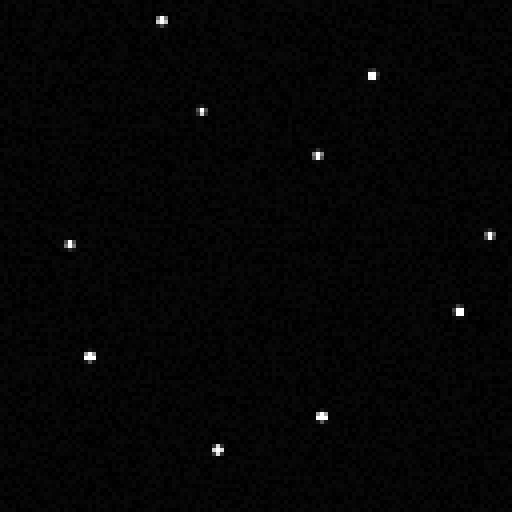
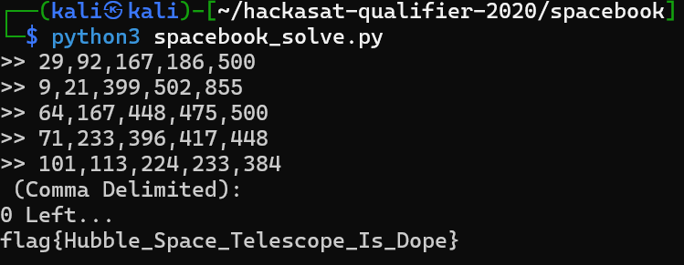

The AAAA category is where the 2020 qualifier starts asking real space questions: where a satellite
is, which way it points, and what its star tracker sees. Most of these services are **time bombs**
that close the connection after a few seconds, so every solution here is a script.

To run the challenges yourself, see the [local setup guide](../local-setup.html).

- [I Like to Watch (`beckley`)](#beckley)
- [Attitude Adjustment (`attitude`)](#attitude)
- [Seeing Stars (`centroids`)](#centroids)
- [Digital Filters, Meh (`filter`)](#filter)
- [SpaceBook (`spacebook`)](#spacebook)

## I Like to Watch (`beckley`) {#beckley}

We are given a **Two-Line Element set** (TLE), the standard data format that describes the
trajectory of an Earth-orbiting object [1], and the time a photo of the Washington Monument was
taken from the satellite. The task is to write a Google Earth KML `LookAt` that places the camera
where the satellite was when it took that photo.

### Geocentric vs topocentric

To solve it, you need the difference between the two coordinate systems involved. Each one has its
own origin, chosen to make a given problem easier.

- **Geocentric** coordinates are centred on the Earth's centre. They are used for global orbit
  determination and satellite tracking, as Cartesian (X, Y, Z) or geodetic (latitude, longitude,
  altitude) coordinates.
- **Topocentric** coordinates are centred on an observer on the Earth's surface. They describe
  ground-station antenna pointing and local visibility, as horizon coordinates (azimuth, elevation,
  range).


*Image: flatearth.ws [2]*

Here we need both: the geocentric position of the satellite (where it is above the Earth), and its
topocentric position as seen from the Washington Monument.

### What Google Earth expects

According to the KML documentation, a `LookAt` needs:

- **latitude and longitude**: the point the camera is looking at, here the Washington Monument;
- **range**: the distance from that point to the camera, here the satellite;
- **heading and tilt**: the direction of the camera, which we get from the topocentric position of
  the satellite.

Careful: heading and tilt are *not* azimuth and altitude.

- **Heading** points *from the camera to the target*, so it is the satellite's azimuth plus 180°.
- **Tilt** is measured from the **zenith**, while altitude is measured from the **horizon**, so
  `tilt = 90° − altitude`.

### Solution

With the TLE and the time of the photo, the Python library **Skyfield** does all the heavy lifting.
The TLE and time depend on the `SEED`, so fill in the values your own session prints.

```python
#!/usr/bin/env python3
# pip install skyfield
from skyfield.api import EarthSatellite, load, wgs84

TLE1 = "1 13337U 98067A   20087.38052801 -.00000452  00000-0  00000+0 0  9995"
TLE2 = "2 13337  51.6460  33.2488 0005270  61.9928  83.3154 15.48919755219337"
TIME = (2020, 3, 26, 21, 54, 29)                  # UTC: Y, M, D, h, m, s
TARGET_LAT, TARGET_LON = 38.8894838, -77.0352791  # Washington Monument

ts = load.timescale(builtin=True)    # no download (the NASA FTP is dead)
sat = EarthSatellite(TLE1, TLE2, "SAT", ts)
t = ts.utc(*TIME)

target = wgs84.latlon(TARGET_LAT, TARGET_LON)
alt, az, dist = (sat - target).at(t).altaz()

heading = (az.degrees + 180) % 360   # Google Earth heading points FROM camera TO target
tilt = 90 - alt.degrees              # tilt is measured from zenith, altitude from horizon
rng = dist.m

print(f"CAMERA={TARGET_LON},{TARGET_LAT},{rng:.0f},{tilt:.9f},{heading:.9f}")
```

Feed the computed camera to the service and the flag comes back in the KML (numbers from my
session):

```console
$ curl "http://localhost:8080/cgi-bin/HSCKML.py?CAMERA=-77.0352791,38.8894838,475066,28.885679882,213.460914590"
<?xml version="1.0" encoding="UTF-8"?>
<kml xmlns="http://www.opengis.net/kml/2.2">
<Placemark>
<name>CLICK FOR FLAG</name>
<description>flag{Hubble_Space_Telescope_Is_Amazing}</description>
<Point>
<coordinates>-77.0354,38.889100</coordinates>
</Point>
</Placemark>
</kml>
```

Full script: [`beckley_solve.py`](files/beckley_solve.py).

**Sources**
1. [Two-line element set](https://en.wikipedia.org/wiki/Two-line_element_set), Wikipedia
2. [Coordinate origins illustration](https://flatearth.ws/wp-content/uploads/2021/11/coordinate-origin.jpg), flatearth.ws

## Attitude Adjustment (`attitude`) {#attitude}

> A satellite's **attitude** is its orientation in space relative to an inertial frame of
> reference. A star tracker figures it out by photographing stars.

We are given a **star catalog**: each line is a direction as a unit vector (X, Y, Z) in a fixed
inertial (celestial) frame, plus a brightness. The catalog doesn't depend on the satellite.

Over netcat, the service sends some of the same stars, identified by their catalog ID, but measured
in the satellite's **body frame**, the way the star tracker sees them:

```text
  ID : X,               Y,              Z
--------------------------------------------------
 104 : 0.253388,        0.822756,       -0.508790
 133 : 0.197420,        0.730983,       -0.653215
 ...
```

The two lists differ only by the satellite's rotation `R`:

```text
v_observed = R · v_catalog
```

In other words, we have a star map and a photo of the same stars taken from the satellite. The
service waits a few seconds for the attitude as a quaternion (`%f,%f,%f,%f`), for **20 rounds** in a
row. Another time bomb, so another script.

### The math, step by step

I wrote everything by hand in pure Python (no numpy, no scipy) to make every formula explicit.

**Unit vectors.** A direction is a vector of length 1: `√(x² + y² + z²) = 1`.

**Dot product.** Between two unit vectors, it gives the cosine of the angle between them:

```text
a · b = ax·bx + ay·by + az·bz = cos θ
```

Stars 104 and 133 above give `a · b ≈ 0.9838`, so they are about 10.3° apart.

**Cross product.** It gives a vector perpendicular to both inputs, with length `sin θ`:

```text
a × b = ( ay·bz − az·by ,  az·bx − ax·bz ,  ax·by − ay·bx )
```

**Rotation matrices.** A 3×3 matrix `R` rotates a vector with `b = R · r`. Its columns are where the
x, y and z axes land after the rotation. A rotation preserves lengths and angles, and its inverse is
simply its transpose: `R⁻¹ = Rᵀ`.

Because rotations preserve angles, there is a free sanity check: the angle between two observed stars
must equal the angle between the same two catalog stars. If it doesn't, the catalog is wrong (wrong
seed, index offset...) and no rotation can fit.

**TRIAD.** With a single star, the satellite could still spin around that star's direction, so we
need two. With two stars, we build three perpendicular axes (a *triad*) with the same recipe in both
frames:

```text
t1 = v1
t2 = (v1 × v2) / |v1 × v2|
t3 = t1 × t2
```

Using t1, t2 and t3 as columns gives `M_ref` (from the catalog vectors) and `M_body` (from the
observed vectors). Both describe the same physical triad seen from two frames, so:

```text
R = M_body · M_refᵀ          (catalog → body)
```

Read it right to left: `M_refᵀ` converts catalog coordinates into triad coordinates, then `M_body`
converts triad coordinates into body coordinates. The reverse trip is `Rᵀ = M_ref · M_bodyᵀ`
(body → catalog).

To limit noise, pick the pair of stars closest to 90° apart. When two stars are nearly parallel,
`v1 × v2` is tiny, and normalizing it amplifies the errors.

**Quaternions.** Any rotation is a single turn by an angle θ around an axis `u` (Euler's rotation
theorem). A quaternion stores exactly that:

```text
q = (x, y, z, w) = ( u · sin(θ/2),  cos(θ/2) )
```

A few properties matter here:

- `q` and `−q` are the same rotation, because θ + 360° ends up in the same place.
- The **conjugate** `q* = (−x, −y, −z, w)` flips the axis, which undoes the rotation. It is the
  quaternion version of the transpose `Rᵀ`.
- To convert the TRIAD matrix into a quaternion, I used **Shepperd's method**, for example
  `w = ½ √(1 + R00 + R11 + R22)`. It has four branches, so it never divides by a number close to 0.

**Going further: QUEST (all stars, optimal).** TRIAD only uses two stars. The optimal least-squares
solution, known as **Wahba's problem**, maximizes:

```text
score(R) = Σ wᵢ · bᵢ · (R rᵢ)        (each term = cos(error), perfect = 1)
```

Davenport showed that this becomes `qᵀ K q`, where `K` is a 4×4 matrix built from
`B = Σ wᵢ bᵢ rᵢᵀ`. The best `q` is the eigenvector of the largest eigenvalue `λ_max`, and `λ_max` is
the best score itself. QUEST (Shuster) finds `λ_max` with Newton's method on the characteristic
polynomial of `K`, starting from 1.

### The convention trap

My first answers (`R`, catalog → body) were all rejected with `Failed...`, even though the error on
every star was essentially 0. The math was right; the convention was not. The server expects the
**body → catalog** rotation, meaning the conjugate `Rᵀ` / `q*`. Sending `(−x, −y, −z, w)` passed the
rounds. `q` versus `−q` doesn't matter, since the server compares rotations, not raw numbers.

### Solution

The core of the solver:

```python
def triad_frame(v1, v2):
    """Columns t1 = v1, t2 = (v1 x v2)/|v1 x v2|, t3 = t1 x t2."""
    t1 = normalize(v1)
    t2 = normalize(cross(v1, v2))
    t3 = cross(t1, t2)
    return [[t1[i], t2[i], t3[i]] for i in range(3)]

def solve_round(catalog, obs):
    refs   = [catalog[i] for i, _ in obs]    # catalog frame
    bodies = [b for _, b in obs]             # body frame
    i, j = pick_best_pair(bodies)            # stars closest to 90 deg apart

    M_ref  = triad_frame(refs[i], refs[j])
    M_body = triad_frame(bodies[i], bodies[j])
    R = matmul(M_body, transpose(M_ref))     # catalog -> body

    return matrix_to_quat(transpose(R))      # body -> catalog = what the server wants

# network loop: read until a full table ("-----" header ... empty line), solve, send
while True:
    chunk = s.recv(4096)
    if not chunk:
        print(buf); break                    # server closed: the flag is in here
    buf += chunk.decode()
    m = TABLE_END.search(buf)
    while m:
        table, buf = buf[:m.end()], buf[m.end():]
        q = solve_round(catalog, parse_observations(table))
        s.sendall(("%f,%f,%f,%f\n" % tuple(q)).encode())
        m = TABLE_END.search(buf)
```

Result: 20/20 rounds, and the server prints the flag.

**Sources**
1. [Wahba's problem](https://en.wikipedia.org/wiki/Wahba%27s_problem), Wikipedia
2. [Triad method](https://en.wikipedia.org/wiki/Triad_method), Wikipedia
3. [Quaternions and spatial rotation](https://en.wikipedia.org/wiki/Quaternions_and_spatial_rotation), Wikipedia
4. M. D. Shuster & S. D. Oh, "Three-axis attitude determination from vector observations", *Journal
   of Guidance and Control*, 1981 (TRIAD and QUEST)
5. S. W. Shepperd, "Quaternion from rotation matrix", *Journal of Guidance and Control*, 1978
6. Ben Eater & 3Blue1Brown, [interactive quaternions](https://eater.net/quaternions)

## Seeing Stars (`centroids`) {#centroids}

The service streams frames from a **star tracker**, the small camera a satellite uses to figure out
which way it is pointing. Each frame is a grid of brightness values sent as CSV text, one row per
line. Scattered across the mostly black background are a handful of bright dots: the stars.

After each frame, the server asks for the **star positions**: find every star and send back its
centre as `x,y`, brightest first.

First, let's look at a frame, stretched to 0–255 so the faint stars are visible:

```console
$ ./stream2img.py frame.txt      # writes star.png
```



### Approach

Three steps per frame:

1. **Separate stars from background** with a threshold computed from the frame's own statistics.
2. **Group** touching bright pixels: a star usually lights up a small cluster, not a single pixel.
3. **Centroid**: compute the centre of each cluster to sub-pixel accuracy, so the reported position is
   precise enough to pass.

### Picking the threshold

The background sits near zero with some sensor noise; the stars are rare bright outliers. To find the
cutoff between the two, there are a few statistical tools:

- **Mean**: the sum of all values divided by their count.
- **Median**: the value that separates the higher half of the data from the lower half.

The bright star pixels pull the mean up, while the median barely moves. After reading some of the
literature, I found that the robust method is a threshold of the **median** plus a few times the
**MAD** (median absolute deviation):

- **MAD**: the median of the absolute distances between each value and the median of the data set.

Median and MAD are used instead of mean and standard deviation because the handful of bright stars
barely shift them, so the threshold follows the true dark background. For normally distributed
noise, `1.4826 × MAD` estimates one standard deviation. Any pixel above `thr` is a candidate star
pixel.

```python
median = np.median(img)
mad    = np.median(np.abs(img - median))
thr    = median + 5 * 1.4826 * mad   # 1.4826 * MAD ≈ one std-dev of the background
```

### Grouping and centroiding

Label the connected blobs of above-threshold pixels:

```python
labels, n = ndimage.label(img > thr, structure=np.ones((3, 3)))
```

For each blob, take the **intensity-weighted centre** after subtracting the background. Weighting by
brightness and removing the noise floor both pull the estimate to sub-pixel accuracy:

```python
weights = img - median
cents   = ndimage.center_of_mass(weights, labels, range(1, n + 1))
flux    = ndimage.sum(weights, labels, range(1, n + 1))
order   = np.argsort(flux)[::-1][:10]   # brightest first; only the top 10 are graded
```

Full scripts: [`centroids_solve.py`](files/centroids_solve.py) and
[`stream2img.py`](files/stream2img.py).

**Sources**
1. [Mean absolute deviation](https://articles.outlier.org/mean-absolute-deviation-meaning), Outlier
2. [esa/tetra3](https://github.com/esa/tetra3), ESA's open-source star tracker

## Digital Filters, Meh (`filter`) {#filter}

We get a simulation of a satellite's attitude-control loop. At each step, the simulator prints the
satellite's **true attitude** as a quaternion `w,x,y,z` and asks us, playing the **star tracker**
(the sensor), to report a measured attitude, also as a quaternion.

Here is the system:

```mermaid
flowchart LR
    T["Target attitude"] --> SUM(("−"))
    SUM -->|error| C["controller.m"]
    C -->|q_accel| P["Plant<br/>(satellite dynamics)"]
    P -->|true attitude| ST["Star tracker (sensor)<br/>⚠ attacker controls this"]
    ST -->|"measured q (our lie)"| K["Kalman filter"]
    K -->|filtered estimate| SUM
    K -->|filtered estimate| LOSE{"|estimate − target| > bound?"}
    LOSE -->|yes| DEAD["Simulation ends: caught"]
    P -->|true attitude| WIN{"rotated > ~22° about y?"}
    WIN -->|yes| FLAG["Flag"]

    classDef attack fill:#3a1414,stroke:#ff5f56,stroke-width:2px;
    classDef good fill:#0f2a17,stroke:#39ff7a,stroke-width:2px;
    class ST attack;
    class FLAG good;
```



A **Kalman filter** predicts the future state of a system with a dynamic model, then compares that
prediction with each measurement to produce an estimate that filters out measurement noise [1].

Our measurement doesn't go straight into the safety check. It first passes through the Kalman
filter, and only the *filtered estimate* is compared with the target attitude. If that estimate ever
drifts too far from the target, the simulation ends.

**Goal:** make the satellite rotate around its y-axis.

### Two design mistakes

1. **The error check is in the wrong place.** It validates the *post-Kalman estimate*, not the raw
   sensor value. The sensor is free to lie, as long as the lie survives filtering without tripping
   the bound.
2. **A Kalman filter can't reject a slow, consistent bias.** It is built to smooth out *noise*
   (random, zero-mean) and *sudden jumps* (large innovations). A small, steady offset fed in at every
   step looks like a legitimate slow slew: the filter tracks it, and the plant follows.

So the attack is to report attitudes *slightly* rotated from the truth, ramping the offset up gently
so the filter never sees a jump large enough to reject, but persistently enough that the real
satellite gets dragged along.

### Finding the right ramp

The catch is the time budget: the simulation only runs about 2000 steps. Too slow and you run out of
steps; too fast and the error check catches you. You need the Goldilocks ramp rate.

Instead of nudging by a fixed amount each step and guessing when to speed up, I command an
**absolute offset from the true attitude that grows linearly with simulation time**:

```python
RATE = math.radians(1.0)   # offset ramps at 1 deg per second of sim time
TS   = 0.05                # sim step (Ts from challenge.m)

a = min(math.pi, RATE * t) # offset angle so far, capped at 180 deg
```

`t` advances by `TS` at each step, so the offset climbs smoothly at a constant rate instead of in
hand-tuned jumps.

### Building the lie

I take the true attitude `q = (w, x, y, z)` sent by the simulator and **left-multiply** it by a
rotation of angle `a` about the −y axis. That rotation quaternion is:

```text
r = (cos(a/2), 0, -sin(a/2), 0)
```

Left-multiplying (`r · q_true`) applies the extra rotation in the *reference frame*, which is what
steers the satellite around y. Expanded as a Hamilton product, with `c = cos(a/2)` and
`s = -sin(a/2)`:

```python
q = (c*w - s*y,     # w
     c*x + s*z,     # x
     c*y + s*w,     # y
     c*z - s*x)     # z
```

Those are the four lines of the solver. At each step I send `q`, the true attitude plus a steadily
growing y-rotation. The Kalman filter follows the gentle drift, the plant rotates, and once the real
satellite passes about 22° the simulator prints the flag.

Full script: [`filter_solve.py`](files/filter_solve.py).

**Sources**
1. [kalmanfilter.net](https://kalmanfilter.net/)

## SpaceBook (`spacebook`) {#spacebook}

We get `test.txt`, a star catalog of 2500 entries, one per line:

```text
X, Y, Z, magnitude
```

`(X, Y, Z)` is a unit vector pointing at the star in a fixed **celestial** reference frame, and
`magnitude` is its relative brightness.

When you connect, the service plays a star tracker on a spacecraft with an unknown orientation. Each
round, it prints the stars it "sees" in the same `X, Y, Z, magnitude` format, except that `(X, Y, Z)`
is now expressed in the spacecraft's **body frame**, rotated by the unknown attitude. It then asks you
to identify 5 of those stars by their catalog index.

**Goal:** get all five right, five rounds in a row, to get the flag.

### The shortcut: magnitude

The observed and catalog vectors are related by an unknown rotation `R`:

```text
v_observed = R · v_catalog
```

So you **cannot** match a star by comparing its `(X, Y, Z)` with the catalog: the coordinates are
different in the two frames. One quantity, however, is *not* affected by rotation: **magnitude**. A
star's brightness doesn't depend on where you look at it from, and the service passes the catalog
magnitude straight through (printed with 6 decimals).

That makes magnitude a unique key into the catalog, which turns the whole problem into a lookup:

```python
catalog = []
with open(CATALOG) as f:
    for i, line in enumerate(f):
        p = line.split(",")
        if len(p) >= 4:
            catalog.append((float(p[3]), i))

def index_of(mag):
    return min(catalog, key=lambda t: abs(t[0] - mag))[1]
```

Rather than matching the printed digits as strings, the solver picks the catalog entry whose
magnitude is **numerically closest**.



Full script: [`spacebook_solve.py`](files/spacebook_solve.py).

### The proper way: angles between stars

After solving it, this felt like a shortcut, so I went to the official repository to check the
intended solution. Here is how you would solve it properly.

A rotation changes every vector's coordinates but preserves the **angles between vectors**. For any
two stars `i` and `j`, the angle between them is the same in both frames:

```text
cos(θ_ij) = v_i · v_j
```

So the dot product between two observed stars equals the dot product between the same two catalog
stars. That is the feature real star trackers match on.

Take the observed stars (the brightest few, for stability) and compute all their pairwise dot
products. The resulting angular separations describe that small constellation independently of the
orientation. Then search the catalog for stars whose pairwise angles reproduce the observed pattern,
within a small tolerance. Two common ways to do it:

- **Angle / triangle matching.** For a pair of observed stars with separation `θ`, keep the catalog
  pairs whose separation is within tolerance of `θ`. Extend a matched pair to a matched triangle
  (three stars, three angles): three consistent angles are almost always enough to identify the stars
  uniquely. This is the classic approach, and real trackers precompute a **k-vector** index over the
  catalog pair angles to make these lookups fast.
- **Geometric voting.** For every observed pair, every catalog pair within tolerance votes for its
  endpoint identities. After all pairs are processed, the correct catalog ID of each observed star
  has far more votes than any coincidental match. It is robust to a few spurious stars.

The leaked magnitude is still useful in the proper solve as a cheap *pre-filter*: it narrows 2500
stars down to a handful of candidates per observed star, and the angles confirm the match. That
hybrid gives robustness without a full k-vector index.

### From identification to attitude

Once each observed star is matched to a catalog star, the service only needs the indices. But you
now also have everything needed to answer the real question, "what is our attitude?": a set of
matched vector pairs `v_observed ↔ v_catalog`.

Recovering `R` from these pairs is **Wahba's problem** again: find the rotation that minimizes

```text
Σ wₖ · ‖ v_observed,k − R · v_catalog,k ‖²
```

The standard closed-form solvers are the same as in [Attitude Adjustment](#attitude):

- **TRIAD**: the minimal method. It uses exactly two star vectors to build two orthonormal triads and
  reads off `R`. Quick, but it only uses two measurements.
- **Davenport's q-method / QUEST**: the proper least-squares solution over *all* matched stars, which
  returns the optimal attitude quaternion. QUEST is the fast, numerically stable version used on real
  spacecraft.
